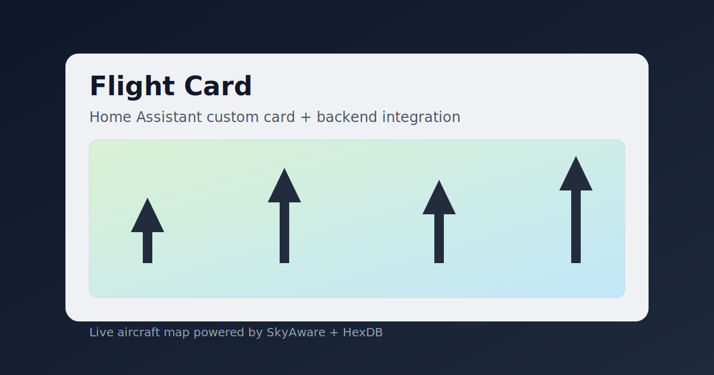

# ADS-B SkyVista

ADS-B SkyVista is a Home Assistant solution for showing live aircraft on a Lovelace map.

It includes:

- a backend integration (`flight_card`) that polls SkyAware and enriches data with HexDB
- a Lovelace custom card (`custom:flight-card`) that renders aircraft on the map
<div align="center">
   

  

</div>



## Requirements

- Home Assistant
- A reachable SkyAware endpoint (for example `http://your-skyaware-host/skyaware/data/aircraft.json`)
- HACS (recommended)

## Install (HACS - Recommended)

1. Add `https://github.com/aplittlecub/Flight-Card` as an **Integration** custom repository.
2. Install **ADS-B SkyVista** (Integration) in HACS.
3. Restart Home Assistant.
4. Go to **Settings -> Devices & Services -> Add Integration** and add **ADS-B SkyVista**.
5. Hard refresh the browser once (`Shift+Reload`) so Home Assistant picks up the auto-registered card module.

This integration now auto-serves and auto-loads the card JavaScript from:

- `/flight_card/flight-card.js`

## Configure Integration

1. Go to **Settings -> Devices & Services -> Add Integration**.
2. Search for **ADS-B SkyVista**.
3. Configure:
   - `Data URL` (example: `http://your-skyaware-host/skyaware/data/aircraft.json`)
   - `Update interval (seconds)`
   - `Max aircraft age (seconds)`
   - `Enable HexDB enrichment`
4. Finish setup.
5. Confirm the sensor exists in **Developer Tools -> States** (usually `sensor.flight_card_aircraft`).

To change `Data URL` later, use **Devices & Services -> ADS-B SkyVista -> Reconfigure**.
Use **Configure** (options) for polling and enrichment settings.

## Add Card to Dashboard

```yaml
type: custom:flight-card
title: ADS-B SkyVista
# optional: card will auto-detect a compatible ADS-B SkyVista sensor
# entity: sensor.aircraft
map_height: 420
default_zoom: 8
fit_bounds: true
```

## Card Options

| Option         | Type    | Default          | Description                                                      |
| -------------- | ------- | ---------------- | ---------------------------------------------------------------- |
| `title`        | string  | `ADS-B SkyVista` | Card title                                                       |
| `entity`       | string  | auto-detect      | Optional sensor entity created by the ADS-B SkyVista integration |
| `map_height`   | number  | `420`            | Map height in px                                                 |
| `default_zoom` | number  | `8`              | Initial zoom                                                     |
| `fit_bounds`   | boolean | `true`           | Auto-fit map to aircraft once per load                           |
| `center_lat`   | number  | `null`           | Optional initial center latitude (manual override)               |
| `center_lon`   | number  | `null`           | Optional initial center longitude (manual override)              |
| `tile_url`     | string  | OSM              | Map tile URL                                                     |
| `attribution`  | string  | OSM              | Tile attribution                                                 |

If `center_lat`/`center_lon` are not set, the card centers automatically from Home Assistant location data (`zone.home`, then HA core location).

## Aircraft Icon Mapping

| SVG           | Preview                                                                     | Matching rules                                                                                              |
| ------------- | --------------------------------------------------------------------------- | ----------------------------------------------------------------------------------------------------------- |
| `a0.svg`      |            | Direct emitter category `A0`                                                                                |
| `a1.svg`      |            | Direct emitter category `A1`                                                                                |
| `a2.svg`      |            | Direct emitter category `A2`                                                                                |
| `a3.svg`      |            | Direct emitter category `A3`                                                                                |
| `a320.svg`    |        | `startsWith("A32")` or `A318 A319 A320 A321 A20N A21N`                                                      |
| `a330.svg`    |        | `startsWith("A33")` or `A300 A306 A310 A332 A333 A339`                                                      |
| `a340.svg`    |        | `startsWith("A34")` or `startsWith("A35")` or `A340 A350 A359 A35K`                                         |
| `a380.svg`    |        | `startsWith("A38")` or `A380 A388`                                                                          |
| `a4.svg`      |            | Direct emitter category `A4`                                                                                |
| `a5.svg`      |            | Direct emitter category `A5`                                                                                |
| `a6.svg`      |            | Direct emitter category `A6`                                                                                |
| `a7.svg`      |            | Direct emitter category `A7` or `A7 F3 F03 EC35 EC45 H145`                                                  |
| `b0.svg`      |            | Direct emitter category `B0` or `B0 B5 B6 B7 F13`                                                           |
| `b1.svg`      |            | Direct emitter category `B1` or `B1 F1 F01 ULM ULTRALIGHT`                                                  |
| `b2.svg`      |            | Direct emitter category `B2` or `B2 F12`                                                                    |
| `b3.svg`      |            | Direct emitter category `B3` or `B3 F4 F04`                                                                 |
| `b4.svg`      |            | Direct emitter category `B4` or `B4 F6 F7 F06 F07`                                                          |
| `b737.svg`    |        | `startsWith("B73")`, `startsWith("B38")`, `startsWith("B39")`, or `B727 B737 B738 B739 B37M B38M B39M`      |
| `b747.svg`    |        | `startsWith("B74")` or `B741 B742 B743 B744 B748`                                                           |
| `b767.svg`    |        | `startsWith("B76")` or `B761 B762 B763 B764 B767`                                                           |
| `b777.svg`    |        | `startsWith("B77")` or `B772 B773 B77L B77W`                                                                |
| `b787.svg`    |        | `startsWith("B78")` or `B788 B789 B78X`                                                                     |
| `c0.svg`      |            | Direct emitter category `C0` or `C0 C1 C2 C3`                                                               |
| `c130.svg`    |        | `startsWith("C13")`, `startsWith("C30")`, or `C130 C135 C17`                                                |
| `cessna.svg`  |    | `startsWith("C15")`, `startsWith("C17")`, `startsWith("C18")`, `startsWith("C20")`, or `startsWith("CESS")` |
| `crjx.svg`    |        | `startsWith("CRJ")` or `CRJ1 CRJ2 CRJ7 CRJ9 CRJX`                                                           |
| `dh8a.svg`    |        | `startsWith("DH8")`, `startsWith("AT7")`, `startsWith("AT4")`, or `DHC8`                                    |
| `e195.svg`    |        | `startsWith("E17")`, `startsWith("E19")`, or `E170 E175 E190 E195`                                          |
| `erj.svg`     |          | `startsWith("E13")`, `startsWith("E14")`, or `ERJ E135 E145`                                                |
| `f100.svg`    |        | `startsWith("F10")`, `startsWith("MD8")`, or `F100 MD80 MD81 MD82 MD83 MD87 MD88`                           |
| `f11.svg`     |          | `F11`                                                                                                       |
| `f15.svg`     |          | `F15`                                                                                                       |
| `f5.svg`      |            | `F5 F05`                                                                                                    |
| `fa7x.svg`    |        | `startsWith("FA7")`, `startsWith("FA8")`, or `E35L`                                                         |
| `glf5.svg`    |        | `startsWith("GLF")`, `startsWith("G5")`, `startsWith("G6")`, or `GLEX`                                      |
| `learjet.svg` |  | `startsWith("C25")`, `startsWith("LJ")`, or `startsWith("LEAR")`                                            |
| `md11.svg`    |        | `startsWith("MD11")` or `MD11`                                                                              |

Matching order matters: first match wins in `iconFromTypeToken`.

## Integration Options

| Option            | Type    | Default                | Description                                        |
| ----------------- | ------- | ---------------------- | -------------------------------------------------- |
| `data_url`        | string  | demo URL shown in form | SkyAware endpoint                                  |
| `update_interval` | number  | `10`                   | Poll interval (seconds)                            |
| `max_age`         | number  | `60`                   | Max `seen` age in seconds                          |
| `hexdb_enabled`   | boolean | `true`                 | Enrich data with HexDB metadata and airframe image |

## Troubleshooting

- If the card says `Entity not found`, set `entity:` to the exact sensor ID from Developer Tools.
- If the card does not appear in card picker, hard refresh browser (`Shift+Reload`) after restarting Home Assistant.
- If the map is empty but sensor has data, confirm the module URL returns `200`: `http://<HA_HOST>:8123/flight_card/flight-card.js`.
- If the integration does not appear, restart Home Assistant after installation.
- If the sensor is unavailable, verify Home Assistant can reach your `data_url`.

## Manual / Local Install

If you are not using HACS:

1. Copy `custom_components/flight_card` into your Home Assistant config folder (`/config/custom_components/flight_card`).
2. Restart Home Assistant.
3. Add the integration in **Settings -> Devices & Services**.
4. Hard refresh the browser (`Shift+Reload`).

## Licensing & Attribution (Final Published - v0.3.2)

ADS-B SkyVista source code is published under **MIT** (see [`LICENSE`](LICENSE)).

Third-party assets/services used by this release:

| Component                                  | License / Terms                                                                   | Required / Recommended attribution                                                                                |
| ------------------------------------------ | --------------------------------------------------------------------------------- | ----------------------------------------------------------------------------------------------------------------- |
| Leaflet (`leaflet` v1.9.4)                 | BSD 2-Clause                                                                      | Keep Leaflet license in redistribution/docs when required (`node_modules/leaflet/LICENSE`)                        |
| OpenStreetMap tiles/data (default layer)   | OSM attribution policy                                                            | **Required:** `© OpenStreetMap contributors` with link to https://www.openstreetmap.org/copyright                 |
| ADS-B Radar aircraft SVG icon pack         | Free for personal/commercial use with backlink requirement (per icon pack readme) | **Required:** `Icons by ADS-B Radar for macOS - https://adsb-radar.com - https://apps.apple.com/app/id1538149835` |
| HexDB lookup API + airframe image endpoint | Service usage terms at provider                                                   | **Recommended:** `Aircraft metadata and airframe image lookup by HexDB - https://hexdb.io`                        |

HexDB endpoints used by this project:

- `https://hexdb.io/api/v1/aircraft/{hex}`
- `https://hexdb.io/hex-image-thumb?hex={hex}`

```text
Map data © OpenStreetMap contributors (https://www.openstreetmap.org/copyright)
Icons by ADS-B Radar for macOS - https://adsb-radar.com - https://apps.apple.com/app/id1538149835
Aircraft metadata and airframe image lookup by HexDB - https://hexdb.io
```

## Developer Notes

- Local test stack: `docker compose -f docker-compose.home-assistant.yml up -d`
- Dev container setup is included in `.devcontainer/`
- Build commands:
  - `npm run check`
  - `npm run build`
  - `npm run build:watch`

## References

- Home Assistant custom cards: https://developers.home-assistant.io/docs/frontend/custom-ui/custom-card/
- Home Assistant frontend data model: https://developers.home-assistant.io/docs/frontend/data/
- Home Assistant data fetching best practices: https://developers.home-assistant.io/docs/integration_fetching_data/
- HACS publish guidance: https://www.hacs.xyz/docs/publish/include/
